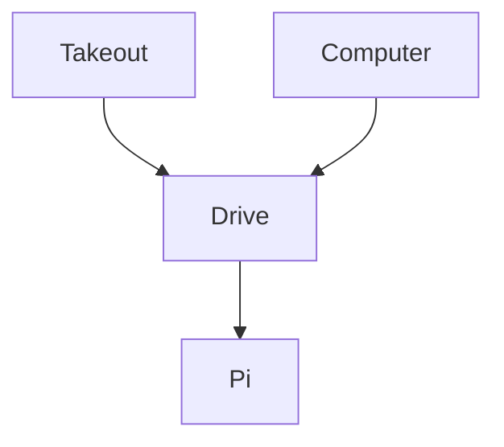

# backup-pi

Connect with:  
```sh
ssh root@192.168.1.81
```

Unlock:  
```sh
sh ~/unlock.sh
```

OAuth Client:  
https://console.cloud.google.com/auth/overview?project=rclone-sync-481117

rclone setup:  
https://rclone.org/drive/



Packages:  
- zfs
- restic
- rclone
- fuse3

zfs:  
```sh
zpool create backup mirror /dev/sda /dev/sdb /dev/sdc /dev/sdd
zfs set mountpoint=/mnt/backup backup
```
