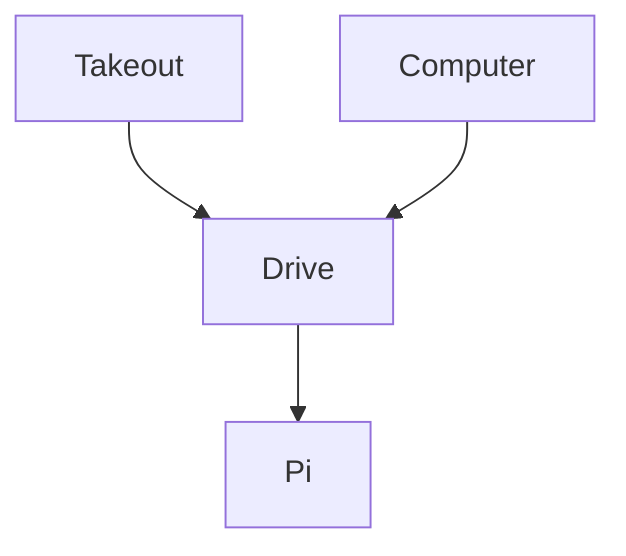

# backup-pi

## How to unlock

This writes the encryption key for rclone and restic.  
The key is then stored into an inmemory mounted file.
This protects against device theft by never storing the encryption key at rest.

```sh
ssh root@192.168.1.81
sh unlock.sh
```

## Overview


Google Takeout does not currently support **automated** export to Google Drive  

## How to deploy

Deploy will prompt you for you healthcheck.io ping_key if not set.

```sh
wget -qO- https://raw.githubusercontent.com/gpolcode/backup-pi/refs/heads/main/deploy.sh | sh
```

## How to setup

Flash the Raspberry Pi Alpine Linux image  
Install these packages:  
```sh
apk add zfs restic rclone fuse3
```

Setup zfs raid-1 over 4 drives:  
```sh
zpool create backup mirror /dev/sda /dev/sdb /dev/sdc /dev/sdd
zfs set mountpoint=/mnt/backup backup
```

Setup rclone:  
https://rclone.org/drive/  
https://rclone.org/commands/rclone_config_encryption_set/

Setup restic:  
https://restic.readthedocs.io/en/stable/030_preparing_a_new_repo.html#local  
