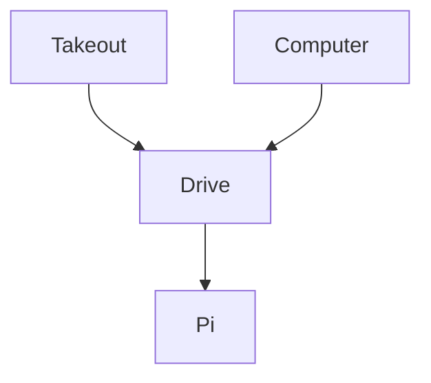

# backup-pi

## How to unlock
Connect with:  
```sh
ssh root@192.168.1.81
# then use
sh ~/unlock.sh
```

## Overview



## How to setup

Raspberry Pi Alpine Linux and install these packages:  
- zfs
- restic
- rclone
- fuse3

zfs:  
```sh
zpool create backup mirror /dev/sda /dev/sdb /dev/sdc /dev/sdd
zfs set mountpoint=/mnt/backup backup
```

OAuth Client:  
https://console.cloud.google.com/auth/overview?project=rclone-sync-481117

rclone setup:  
https://rclone.org/drive/

restic setup:  
https://restic.readthedocs.io/en/stable/030_preparing_a_new_repo.html#local  
