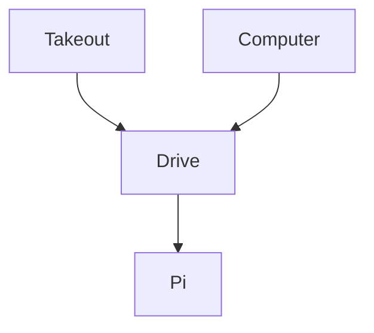

# backup-pi

## How to unlock

This writes the encryption key for rclone and restic.  
The key is then stored into an inmemory mounted file.  
This protects against device theft by never storing the encryption key at rest.

It also mounts a dedicated 1G tmpfs at `/tmp/rclone-cache` for the rclone VFS
cache. The cache holds plaintext copies of Drive files, so it stays in RAM for
the same reason the key does. `size=` is a ceiling rather than a reservation,
and the cache is sparse and evicted after 10 minutes, so at rest it holds
almost nothing.

```sh
ssh root@192.168.1.81
sh unlock.sh
```

## Overview


```mermaid
graph TD;
    Takeout-->Drive;
    Computer-->Drive;
    Drive-->Pi;
```
Google Takeout does not currently support **automated** export to Google Drive  

## How to deploy

Deploy will prompt you for your healthcheck.io ping_key if not set.

```sh
wget -qO- https://raw.githubusercontent.com/gpolcode/backup-pi/refs/heads/main/deploy.sh | sh
```

Note: This disables USB/WiFi/BT and enables PCIe x1.   

## How to setup

Flash the Raspberry Pi Alpine Linux image  
Install these packages:  
```sh
apk add zfs restic rclone fuse3 smartmontools
```

Setup zfs 4-way mirror over 4 drives:  
```sh
zpool create backup mirror /dev/sda /dev/sdb /dev/sdc /dev/sdd
zfs set mountpoint=/mnt/backup backup
```

Setup rclone:  
https://rclone.org/drive/  
https://rclone.org/commands/rclone_config_encryption_set/

Setup restic:  
https://restic.readthedocs.io/en/stable/030_preparing_a_new_repo.html#local  
